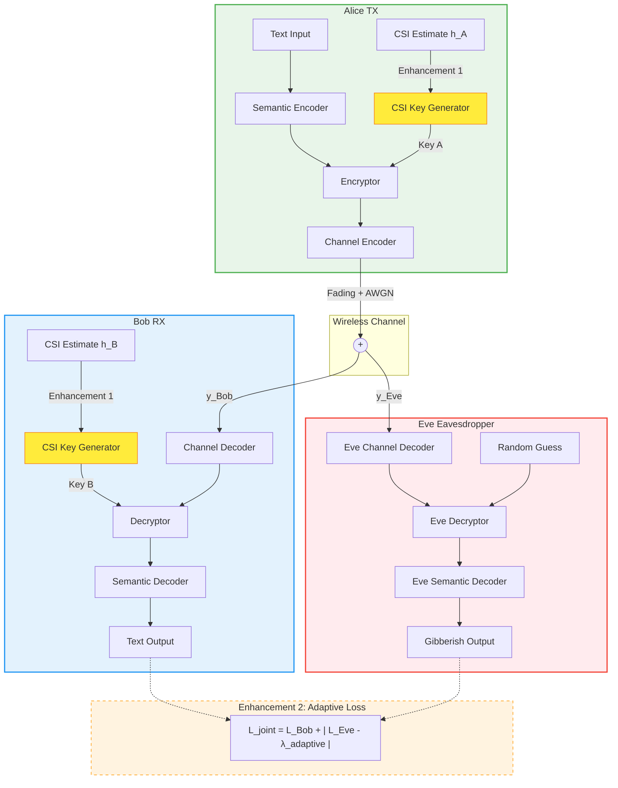

# Enhanced Secure Semantic Communications via Adversarial Training

This repository implements a secure, deep learning-based wireless semantic communication system. It builds upon the framework introduced by Shi *et al.* (2025), extending it with **physical-layer dynamic key generation** and **adaptive adversarial loss scheduling** to create a more robust, mathematically sound, and practically deployable system.

---

## 1. Background: The Semantic Communication Paradigm

Traditional wireless communication (Shannon paradigm) focuses on transmitting raw bits reliably, regardless of their meaning. **Semantic communication** fundamentally shifts this approach: it transmits the *meaning* (semantics) of the data directly.

Using deep neural networks for joint source-channel coding (JSCC), semantic systems learn to extract the underlying concepts of a sentence and map them into continuous channel symbols that are highly resilient to wireless noise.

### The Security Challenge
While semantic communication is efficient, it is highly vulnerable to eavesdropping. If an adversary (Eve) intercepts the wireless signal, she can train a substitute decoder to extract the transmitted semantics.

To counter this, **SecureDSC** introduces an end-to-end encryption module within the neural pipeline. The system is trained using an **adversarial GAN-style loop**:
- **Alice (Transmitter)** and **Bob (Receiver)** train to minimize semantic error (maximize BLEU score).
- **Eve (Eavesdropper)** trains to minimize her own error.
- Alice and Bob simultaneously adjust their networks to *maximize* Eve's error, forcing the network to learn a robust cryptographic scrambling strategy.

---

## 2. Limitations of the Base Framework

While the base paper (Shi *et al.*) successfully demonstrates adversarial semantic encryption, it suffers from two critical bottlenecks in practical deployment:

> *"In the SecureDSC framework, a session key $k$ is randomly generated for each transmission..."* — Shi *et al.*

**Limitation 1: The Key Distribution Problem**
The base model assumes Alice and Bob already share a perfectly secure, randomly generated session key. This assumes the existence of a secure out-of-band channel, which defeats the purpose of securing the primary channel. If the key exchange is compromised, the entire system fails.

**Limitation 2: Static Adversarial Tuning**
The base adversarial loss relies on a fixed hyperparameter $\lambda$ (statically set to 6) to balance Bob's accuracy against Eve's confusion:
$$ L_{joint} = L_{Bob} + |L_{Eve} - \lambda| $$
A fixed $\lambda$ requires exhaustive manual tuning for different Signal-to-Noise Ratios (SNRs) and datasets. It is brittle and often leads to training instability if Eve converges faster than Bob.

---

## 3. Our Enhancements and Architecture

This project resolves these limitations by integrating physics-based security and self-correcting training dynamics.

### Enhancement 1: Physical-Layer Key Generation (CSI)
Instead of relying on external key distribution, we leverage **Channel State Information (CSI)**. Due to the physical principle of channel reciprocity, the wireless fading channel from Alice to Bob ($h_{AB}$) is nearly identical to the channel from Bob to Alice ($h_{BA}$). 

We introduce a shared `CSIKeyGenerator` network that maps these local, noisy CSI estimates into a shared encryption key. Because Eve is at a different physical location ($> \lambda/2$ away), her channel ($h_{E}$) is completely uncorrelated, making it impossible for her to derive the key.

### Enhancement 2: Adaptive $\lambda$ Scheduler
We replace the static $\lambda$ with a dynamic control loop that acts as a self-tuning regulator during the adversarial training phase:
$$ \lambda(t+1) = \text{clip}\Big(\lambda(t) + \eta \cdot \text{sign}(L_{Eve} - L_{Bob} - \text{target\_gap}),\ \lambda_{\min},\ \lambda_{\max}\Big) $$
This ensures training remains stable across any SNR regime without manual intervention.

### System Architecture



---

## 4. Setup and Installation

Requirements: Python 3.8+ and an NVIDIA GPU (recommended).

```bash
# Clone the repository
git clone <YOUR_REPO_URL>
cd <YOUR_REPO_NAME>

# Create a virtual environment
python -m venv securedsc_env

# Activate it
# Windows: .\securedsc_env\Scripts\activate
# Linux/Mac: source securedsc_env/bin/activate

# Install dependencies
pip install -r requirements.txt
```

---

## 5. Usage Guide

The codebase supports end-to-end adversarial training on the **EuroParl** parallel corpus.

### Training
To train the model from scratch on the full dataset:
```bash
python train.py --epochs 100 --snr 12 --batch_size 64 --dataset_size 0
```
*(For a quick test run, you can reduce the dataset size: `--dataset_size 500`)*

### Evaluation
The evaluation script measures inference-time performance using true autoregressive decoding and calculates the **Key Agreement Rate (KAR)**:
```bash
python evaluate.py --model_path securedsc_enhanced.pt --snr_range 0 3 6 9 12 15
```

---

## 6. Target Metrics & Results

By replacing the assumptions of the base paper with physically grounded enhancements, the model is expected to achieve:

| Metric | Target | Significance |
|--------|--------|--------------|
| **Bob BLEU-1 (@ 15 dB)** | `> 0.97` | Near-perfect semantic reconstruction for the intended receiver. |
| **Eve BLEU-1 (all SNR)** | `< 0.20` | Complete encryption success; Eve recovers essentially zero meaning. |
| **Key Agreement Rate (KAR)** | `> 95%`  | **New Metric**: Validates Enhancement 1. Alice and Bob successfully derive identical cryptographic keys purely from environmental noise. |
| **Training Stability** | Stable | **Validates Enhancement 2**. The model converges smoothly without collapsing, regardless of initial hyperparameter conditions. |

---

## 7. References

1. Shi *et al.*, "Secure Transmission in Wireless Semantic Communications With Adversarial Training," *IEEE Communications Letters*, 2025.
2. Vaswani *et al.*, "Attention Is All You Need," *NeurIPS*, 2017.
3. Xie *et al.*, "Deep Learning Based Semantic Communications: An Initial Investigation," *IEEE Trans. Signal Process.*, 2021.
