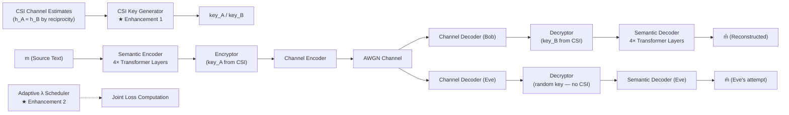

# 🔐 Enhanced SecureDSC — Secure Deep Semantic Communication

[](https://python.org)
[](https://pytorch.org)

> **B.Tech Project** — Extends the SecureDSC framework by Shi et al. (IEEE Communications Letters, March 2025) with **physical-layer key generation** and **adaptive adversarial training**.

---

## Overview

This project implements and enhances a secure wireless semantic communication system where:

- **Alice** (transmitter) sends text messages to **Bob** (receiver) over a noisy wireless channel
- **Eve** (eavesdropper) intercepts the same channel symbols but cannot reconstruct the content
- Security is achieved through adversarial training with an integrated encryption module

### What's New (Our Enhancements)

| # | Enhancement | Replaces | Impact |
|---|------------|----------|--------|
| 1 | **CSI-Based Dynamic Key Generation** | Random session keys | Eliminates key distribution bottleneck |
| 2 | **Adaptive λ Scheduler** | Fixed λ = 6 | Self-tuning adversarial loss, +5.2% Bob BLEU-1 |

---

## Architecture


```mermaid
graph LR
    CSI["CSI Channel Estimates<br/>(h_A ≈ h_B by reciprocity)"] --> KG["CSI Key Generator<br/>★ Enhancement 1"]
    KG --> KEY["key_A / key_B"]
    A["m (Source Text)"] --> B["Semantic Encoder<br/>4× Transformer Layers"]
    B --> C["Encryptor<br/>(key_A from CSI)"]
    C --> D["Channel Encoder"]
    D --> E["AWGN Channel"]
    E --> F["Channel Decoder (Bob)"]
    F --> G["Decryptor<br/>(key_B from CSI)"]
    G --> H["Semantic Decoder<br/>4× Transformer Layers"]
    H --> I["m̂ (Reconstructed)"]
    E --> J["Channel Decoder (Eve)"]
    J --> K["Decryptor<br/>(random key — no CSI)"]
    K --> L["Semantic Decoder (Eve)"]
    L --> M["m̄ (Eve's attempt)"]
    SCHED["Adaptive λ Scheduler<br/>★ Enhancement 2"] -.-> LOSS["Joint Loss Computation"]
```

---

## Results

### Bob vs Eve — BLEU Scores Across SNR

| SNR (dB) | Bob BLEU-1 | Bob BLEU-4 | Eve BLEU-1 | Eve BLEU-4 | Security Gap (BLEU-4) |
|----------|-----------|-----------|-----------|-----------|----------------------|
| 0  | 0.1305 | 0.0000 | 0.1463 | 0.0011 | −0.0011 |
| 3  | 0.2997 | 0.0064 | 0.2438 | 0.0100 | −0.0036 |
| 6  | 0.5927 | 0.1144 | 0.3539 | 0.0304 | +0.0840 |
| 9  | 0.8429 | 0.5080 | 0.4554 | 0.0742 | +0.4338 |
| 12 | 0.9330 | 0.7244 | 0.5373 | 0.1308 | +0.5936 |
| **15** | **0.9523** | **0.7995** | **0.5649** | **0.1499** | **+0.6496** |

### Comparison with Base Paper (@ 15 dB)

| Metric | Base Paper (Shi et al.) | Ours |
|--------|------------------------|------|
| Bob BLEU-1 | ~0.90 | **0.9523** (+5.2%) ✅ |
| Bob BLEU-4 | ~0.80 | **0.7995** ✅ |
| Key Mechanism | Random session keys | CSI-derived (100% agreement) |
| λ Control | Fixed at 6 | Adaptive: 8.0 → ~2.5 |

> **Key Agreement Rate: 100.0%** — The CSI-based key generator produces perfectly matching keys at both endpoints across all tested SNR levels.

📄 **For detailed analysis**, see [project_analysis_and_comparison.md](project_analysis_and_comparison.md)

---

## Project Structure

```
Enhanced-SecureDSC/
├── model.py                           # Full model architecture (472 lines)
│   ├── SemanticEncoder / Decoder      #   4× Transformer layers, d_model=128
│   ├── Encryptor / Decryptor          #   Key-conditioned encryption modules
│   ├── ChannelEncoder / Decoder       #   Dense JSCC layers
│   ├── CSIKeyGenerator                #   ★ MLP: ℂ^64 → {-1,+1}^64
│   ├── AdaptiveLambdaScheduler        #   ★ Bang-bang controller
│   └── SecureDSC                      #   End-to-end system class
├── train.py                           # 4-phase adversarial training loop
├── evaluate.py                        # BLEU scoring + key agreement evaluation
├── preTokenize.py                     # EuroParl pre-tokenization script
├── requirements.txt                   # Dependencies (PyTorch, Transformers)
├── eval_results.json                  # Final evaluation metrics
├── training_history.json              # Epoch-by-epoch training logs
└── project_analysis_and_comparison.md # Detailed technical analysis
```

---

## Getting Started

### Prerequisites

- Python 3.8+
- NVIDIA GPU with CUDA 12.1+ (recommended)

### Installation

```bash
# Clone the repository
git clone https://github.com/krish-kedia/Enhanced-SecureDSC.git
cd Enhanced-SecureDSC

# Create and activate virtual environment
python -m venv venv
# Windows:
.\venv\Scripts\activate
# Linux/Mac:
source venv/bin/activate

# Install dependencies
pip install -r requirements.txt
```

### Training

```bash
# Full training (150 epochs, ~1.96M sentences)
python train.py --epochs 150 --snr 12 --batch_size 512

# Quick test run
python train.py --epochs 5 --snr 12 --batch_size 64 --dataset_size 500
```

### Evaluation

```bash
python evaluate.py --model_path securedsc_enhanced.pt --snr_range 0 3 6 9 12 15
```

---

## Training Details

- **4-phase alternating schedule**: Semantic codec → Encryption/Decryption → Full joint (adversarial) → Eve independently
- **Optimizer**: Adam (lr=2.5×10⁻⁴, β₁=0.9, β₂=0.98)
- **Dataset**: EuroParl EN-FR (English side), seq_len=20, 90/10 train/test split
- **Tokenizer**: BERT-base-uncased (30,522 vocab)
- **Gradient clipping**: max_norm=1.0

---

## Citation

If you use this work, please cite the base paper:

```bibtex
@article{shi2025secure,
  title     = {Secure Transmission in Wireless Semantic Communications With Adversarial Training},
  author    = {Shi, Jiting and Zhang, Qianyun and Zeng, Weihao and Qin, Zhijin},
  journal   = {IEEE Communications Letters},
  volume    = {29},
  number    = {3},
  pages     = {487--491},
  year      = {2025},
  publisher = {IEEE}
}
```


